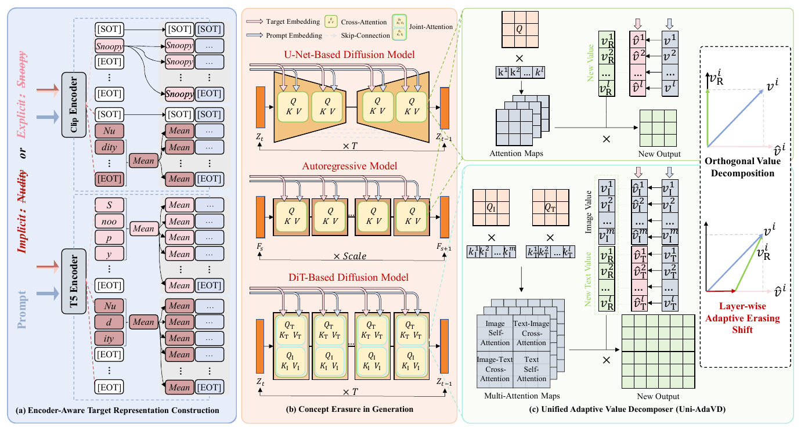

# Uni-AdaVD

**Universal Concept Erasure for Visual Generation via Orthogonal Value Decomposition**

Qifan Zhou, Yuan Wang, Yanbin Hao, Xiang Wang, Kuien Liu, Richang Hong, and Meng Wang

<h3>
  <a href="https://qifanzhou.github.io/"><strong>Project Website</strong></a> |
  <a href="https://qifanzhou.github.io/assets/TPAMI_2026_AdaVD_3.pdf"><strong>Arxiv Preprint</strong></a>
</h3>



Uni-AdaVD is an inference-time concept erasure framework for text-conditioned visual generation. It suppresses target-aligned semantics in attention value features without fine-tuning or permanently modifying the pretrained model weights. The same framework is implemented for U-Net-based diffusion, diffusion transformers, autoregressive image generation, and text-to-video generation.

## From AdaVD to Uni-AdaVD

Uni-AdaVD extends the original AdaVD formulation from the earlier U-Net / SD v1_4 setting to diffusion transformers, autoregressive image generation, and text-to-video generation, while also broadening the erasure scope from explicit concepts to more implicit unsafe concepts.

Earlier AdaVD work: *Precise, Fast, and Low-cost Concept Erasure in Value Space: Orthogonal Complement Matters* (CVPR 2025).

- [**Paper**](https://arxiv.org/abs/2412.06143)
- [**Code**](https://github.com/WYuan1001/AdaVD)

This repository contains the public inference code for five generator backbones:

| Task | Architecture | Backbone | Entry point | Instructions |
| --- | --- | --- | --- | --- |
| Text-to-image | U-Net diffusion | SD v1_4 | [`sdv1_4.py`](texttoimage/sd1-4/sdv1_4.py) | [README](texttoimage/sd1-4/README.md) |
| Text-to-image | Diffusion transformer | SD v3 | [`sd3_uniadavd.py`](texttoimage/sd3/sd3_uniadavd.py) | [README](texttoimage/sd3/README.md) |
| Text-to-image | Diffusion transformer | FLUX | [`flux_uniadavd.py`](texttoimage/flux/flux_uniadavd.py) | [README](texttoimage/flux/README.md) |
| Text-to-image | Autoregressive transformer | Switti-AR | [`run_switti_adavd.py`](texttoimage/switti-ar/run_switti_adavd.py) | [README](texttoimage/switti-ar/README.md) |
| Text-to-video | U-Net diffusion | ZeroScopeT2V | [`adavd_zeroscope_t2v.py`](texttovideo/zeroscope/adavd_zeroscope_t2v.py) | [README](texttovideo/zeroscope/README.md) |

Model checkpoints are not included. Download the required pretrained weights from their official sources and pass either a local checkpoint path or a supported model identifier to the corresponding entry point.

## Method Overview

Uni-AdaVD consists of three main components:

- **Encoder-aware Target Representation Construction (ETRC)** constructs target representations according to the text encoder and concept type. It distinguishes explicit concepts from implicit concepts and supports heterogeneous encoders such as CLIP and T5.
- **Orthogonal Value Decomposition (OVD)** decomposes text-derived attention values into target-aligned and target-orthogonal components. The target-orthogonal component is retained during generation.
- **Layer-wise Adaptive Erasing Shift (LAES)** adjusts erasure strength across network layers to improve the balance between target suppression and non-target preservation.

All interventions are applied during inference. The original model parameters remain unchanged.

## Concept Settings

Uni-AdaVD supports two concept settings:

| Setting | Typical concepts | Prompt source | Main arguments |
| --- | --- | --- | --- |
| Explicit | instances, artistic styles, celebrities | Template prompts generated from evaluation concepts | `--erase_type`, `--target_concept`, `--contents` |
| Implicit | nudity and broader NSFW concepts | Benchmark prompts from CSV or JSON files | `--target_concept`, `--prompt_file` or `--csv_path` |

For explicit erasure, `--target_concept` specifies the concept to suppress, while `--contents` specifies the target and non-target concepts used to instantiate evaluation templates. Comma-separated target concepts enable multi-concept erasure on supported backbones.

For implicit erasure, prompts are loaded from datasets such as I2P or SafeSora. Target-representation options and recommended sigmoid settings differ by backbone; use the model-specific README linked above rather than transferring parameters between architectures.

## Generation Modes

The inference scripts use the following generation modes:

- `original`: generate with the unmodified pretrained model.
- `retain`: suppress the target-aligned value component and generate from the retained component.
- `erase`: generate from the removed target-aligned component for analysis.

Most diffusion entry points accept comma-separated modes such as `--mode original,retain`. Switti-AR runs one mode per invocation. See each script's `--help` output for the exact interface.

## Installation

The code is divided into three dependency groups because Switti-AR and ZeroScope require different runtime stacks.

### SD v1_4, SD v3, and FLUX

```bash
conda create -n uniadavd_ti python=3.9 -y
conda activate uniadavd_ti
pip install -r texttoimage/requirements.txt
```

### Switti-AR

```bash
conda create -n uniadavd_switti python=3.10 -y
conda activate uniadavd_switti
pip install -r texttoimage/switti-ar/requirements.txt
```

Switti-AR additionally requires its VQ-VAE and two text-encoder checkpoints. Their environment variables and expected paths are documented in the [Switti-AR instructions](texttoimage/switti-ar/README.md).

### ZeroScopeT2V

```bash
conda create -n uniadavd_t2v python=3.9 -y
conda activate uniadavd_t2v
pip install -r texttovideo/zeroscope/requirements.txt
```

The requirement files contain the versions used by the public entry points. If the pinned PyTorch build does not match the local CUDA runtime, install the appropriate CUDA-compatible PyTorch build before installing the remaining dependencies.

## Repository Structure

```text
Uni-AdaVD/
|-- datasets/
|   |-- ring_a_bell/
|   |-- safesora/
|   |-- coco_30k.csv
|   |-- i2p_benchmark.csv
|   `-- mma_diffusion_nsfw_adv_prompts.csv
|-- texttoimage/
|   |-- sd1-4/
|   |-- sd3/
|   |-- flux/
|   |-- switti-ar/
|   `-- requirements.txt
`-- texttovideo/
    `-- zeroscope/
```

Each backbone directory contains a dedicated README with setup instructions and backbone-specific usage examples.

## Datasets

The [`datasets`](datasets/README.md) directory provides the prompt files used by the released scripts:

- **I2P** for implicit unsafe-image evaluation.
- **COCO-30k** for prior-preservation evaluation.
- **MMA-Diffusion** and **Ring-A-Bell** for adversarial-prompt evaluation.
- **SafeSora** category splits for text-to-video safety evaluation.

Explicit template definitions are kept with each image-model entry point so that those backbone directories remain independently runnable.

The datasets remain subject to their original licenses and terms of use. Some prompts contain unsafe or offensive material and should be handled only in an appropriate research environment.

## Outputs

All entry points write generated results under the path supplied through `--save_root`. The exact directory hierarchy depends on the backbone and evaluation mode. The original and retained outputs can be generated with matched prompts and seeds for direct comparison.

## Citation

The paper citation will be added when the public manuscript is available.
